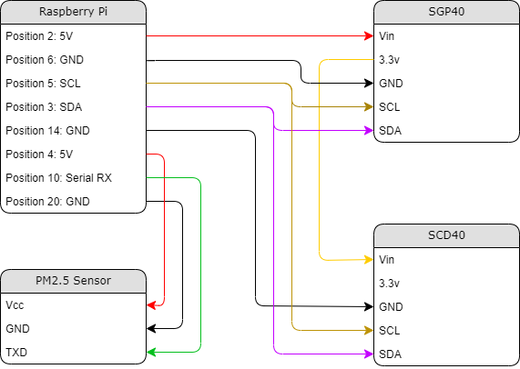

# Air Quality Sensor

A small air quality sensor that measures various 
aspects and logs them for later analysis.
Measures: VOC, C02, temperature, PM2.5, and humidity

## Hardware

Raspberry Pi
Adafruit SGP40 (https://learn.adafruit.com/adafruit-sgp40/python-circuitpython)  
Adafruit SCD-40 (https://learn.adafruit.com/adafruit-scd-40-and-scd-41/python-circuitpython)  
Adafruit PM 2.5 Sensor (https://learn.adafruit.com/pm25-air-quality-sensor)  

## How to use

### Wiring

- Notice that we are using the voltage regulator of the SGP40 to power the SCD40. This is because there is limited current supply from the Raspberry Pi and the RPi is notorious for weird bugs when underpowered.
- Additionally we need two wires that are split (purple and brown) so that both SGP40 & SCD40 can share the RPi i2c pins.

### Coding

1. Download repo

~~~bash
cd ~
git clone https://github.com/patrickslarson8/air_quality_sensor.git
~~~

2. Install requirements on system

~~~bash
cd air_quality_sensor
sudo apt-get install sqlite3 python3-pip
~~~

3. Install python packages

~~~bash
pip3 install -r requirements.txt
~~~

4. Create SQLite database

~~~bash
cd air-quality-service
sqlite3 database.db
sqlite> BEGIN;
sqlite> CREATE TABLE sensor_table (timestamp DATETIME, temp NUMERIC, humid NUMERIC, carbon NUMERIC, voc NUMERIC, pm10 NUMERIC, pm25 NUMERIC);
sqlite> CREATE TABLE note_table (timestamp DATETIME, note text);
sqlite> COMMIT;
~~~

1. Configure air_quality.py and webserver.py to autostart

- Open air_quality.service and web_server.service in a text editor and ensure the two locations for ExecStart point to your python interpretor and air_quality.py locations
- Copy air_quality.service to /lib/systemd/system/
- Add the correct permissions to the service file

~~~bash
sudo cp air_quality.service /lib/systemd/system/air_quality.service
sudo chmod 644 /lib/systemd/system/air_quality.service
sudo cp web_server.service /lib/systemd/system/web_server.service
sudo chmod 644 /lib/systemd/system/web_server.service
~~~

- Configure service to start

~~~bash
sudo systemctl daemon-reload
sudo systemctl enable air_quality.service
sudo systemctl enable web_server.service
sudo reboot
~~~

## Todo list

1. Complete web page display
2. Add notes input to web page
3. Configure RPi to reboot regularly
4. Make air_quality service fault tolerant
  - Sensor Disconnect
  - Database non-existance
5. Normalize database in program files
  - Add join table for notes and data
